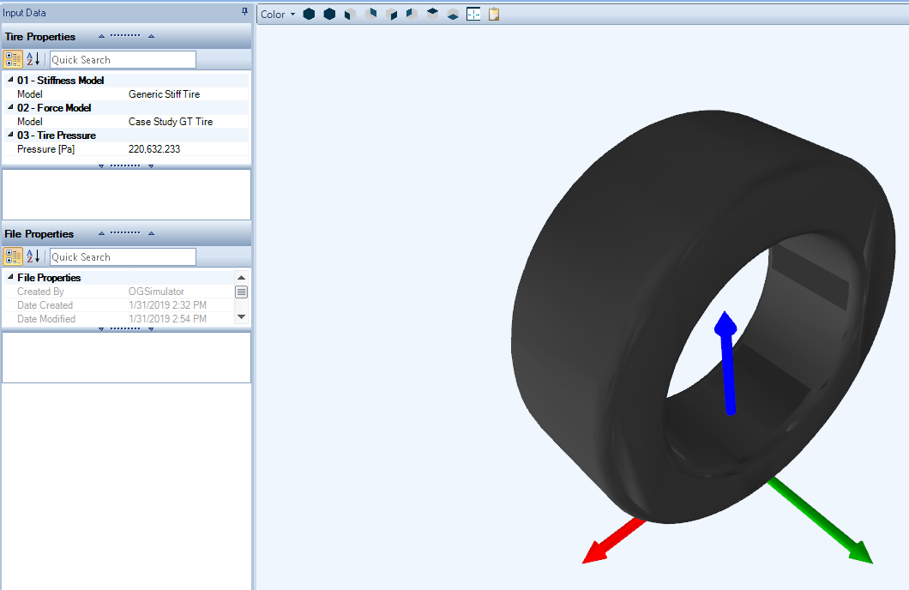
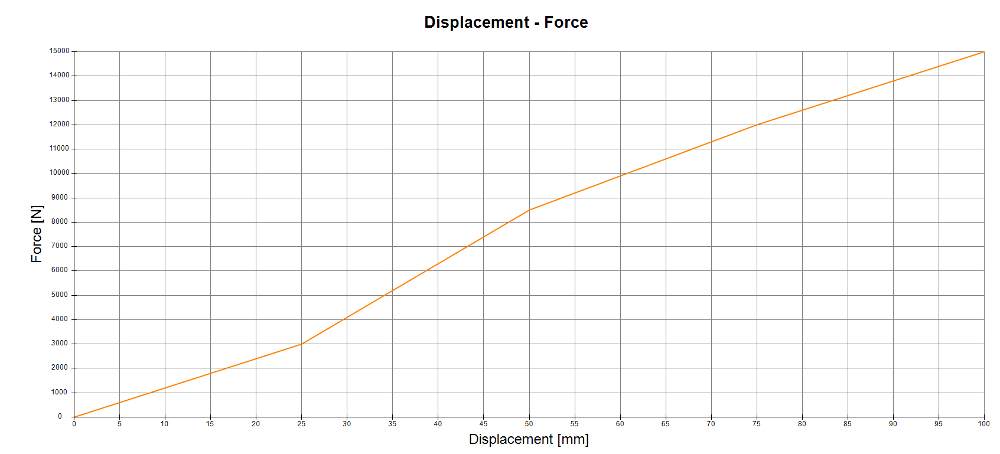

#Understanding Vehicle Design

Vehicle design covers all the components used in a vehicle setup in OptimumDynamics. In this part of the project, a vehicle is built from its core components into an overall vehicle model that can be used for later simulation and analysis. The following components must be included in an OptimumDynamics vehicle definition if simulation is to be undertaken:
 
* __Tire Stiffness__
* __Tire Force Model__
* __Tire__
* __Chassis__
* __Spring/Torsion bar__
* __Coilover__
* __Suspension__
* __Brakes__
* __Drivetrain__
 
The following components can also be optionally included:
 
* __Anti-roll Bar (ARB)__
* __Bump Stop__
* __Aerodynamics__
* __Center Element__
* __Engine__
* __Gearbox__
* __Differential__
 
These components can be included in various forms of detail depending on the information known. In the vehicle design tab, new components can be defined either from the ribbon menu at the top of the screen or by right-clicking the component folders in the project tree. The following section has been set up to help a user create the fundamental components of a vehicle setup and then expand into the optional components that can be added.   The full list of components with links to the appropriate section is included on the next page.

#Library

The project tree comes pre-filled with a project library that stores the information for each component.  As the different vehicle components are created, they will be added to the library folder that corresponds to the component created.  Additional libraries can be added, allowing for better content management if there is more than one distinct vehicle in a project.  The libraries can be created by right clicking on the library intended and then selecting the new folder option.

#Constant Stiffness Tire

The stiffness of the tires on the vehicle is necessary so that the tire deflection can be accounted for in roll angle, pitch angle, ride height, load transfer distribution, and more. The constant tire stiffness model assumes that the tire vertical stiffness is a constant and unchanging parameter.

To solve for tire stiffness in the system, the tire stiffness must be a non-zero value and the unloaded radius of the tire must be known.  Please note, when validating a vehicle, the tire stiffness must be great enough that the car does not excessively compress the tires under static conditions.  The unloaded radius and width of the tire can either be measured or identified from the markings on the tire sidewall.

__Input Name__|__Description__
-|-
__Vertical Stiffness__|The vertical stiffness of the tire
__Unloaded Radius__|The outer radius of the tire while under no load
__Width__|Nominal width of the tire. This is only used for visualization purposes and does not affect the simulation results.

#Non-Linear Stiffness Tire

A non-linear stiffness tire is defined by a set of data points describing the force response with displacement. Data should be input that covers the entire possible operating range of the tire. These curves are often determined from physical testing.  OptimumDynamics then uses the data as a lookup table and interpolates the points in between each data point.  This is especially useful if the tires have a progressive spring rate or comparable characteristics.

__Input Name__|__Description__
-|-
__Unloaded Radius__|The outer radius of the tire while under no load
__Width__|Nominal width of the tire. This is only used for visualization purposes and does not affect the simulation results.

#Constant Friction Tire

Tire forces are one of the driving components to a vehicle simulation as they are directly required for calculations of Yaw Moment, lateral acceleration, and longitudinal acceleration and indirectly used for calculations of roll angle, stability, ride height and more.  The vehicle simulation in OptimumDynamics relies on knowing the actual forces generated at the tire contact patch for each wheel.  The constant friction tire is the simplest type of tire model that OptimumDynamics offers. You must define the constant friction limit of the tire. The coefficient defined describes the maximum combined lateral and longitudinal friction factor. This assumes a linear friction limit with no account for slip angle or slip ratio.

This can be approximated from physical testing by knowing the maximum lateral acceleration of the vehicle.  This assumes that there is negligible downforce being applied to the vehicle and a uniform friction coefficient across each tire. If the tires being used on each corner of the vehicle are not identical, then the friction limit will be different for each physical tire model being used.  If this is the case for the vehicle, loading on each of the tires must be known and each individual friction coefficient must be solved for.

Note that this friction limit will be different for each physical tire model being used.  If this is the case for the vehicle, loading on each of the tires must be known.

__Input Name__|__Description__
-|-
__Coefficient of Friction__|The maximum coefficient of friction of the tire. For this model it is assumed to be a constant value. It is used for determining the combined lateral and longitudinal tire force

#Full Tire Model

More complex tire force characteristics can be determined in OptimumDynamics using full tire models. Several industry-standard tire models are included in OptimumDynamics for use and can be imported from external tire modelling software or from OptimumTire.

__Tire Model__|__Description__
-|-
__Pacejka 2002__|This model is given in Pacejka’s book "Tire and Vehicle Dynamics" published in 2002. It is like the ’96 model but has additional coefficients in the combined lateral and longitudinal models. It also includes models for the rolling resistance and overturning moment. This model includes 89 coefficients.
__Pacejka 2002 w/ Pressure Effects__|This model is described in the paper "Extending the Magic Formula and SWIFT Tyre Models for Inflation Pressure Changes" by Dr. Ir. A.J.C. Schmeitz, Dr. Ir. I.J.M. Besselink, Ir. J. de Hoogh, and Dr. H. Nijmeijer. This model incorporates the effect of inflation pressure into the Pacejka 2002 model. Ten additional coefficients, including the reference pressure Pi0, are added to the model. These coefficients appear in the pure lateral, longitudinal, and aligning torque models. This model includes 99 coefficients.
__Pacejka 2006__|This model is given in the second edition of Pacejka’s book "Tire and Vehicle Dynamics" published in 2006. This model is based off the 2002 model but includes significant modifications to the pure lateral and aligning torque models. An additional coefficient is also added to both the combined lateral and longitudinal models. This model includes 97 coefficients.
__Pacejka 96 Model__|This model is given in the 1996 paper "The Tire as a Vehicle Component" by Hans B. Pacejka. This model includes the combined lateral and longitudinal tire response as well as lateral camber response and load sensitivity. This model does not include the rolling resistance or overturning moment of the tire. This model includes 78 coefficients.
__Fiala__|The Fiala tire model is based on the physical characteristics of the tire. This model does not include combined longitudinal or lateral force, the effect of inclination angle, the lateral force offset at zero slip (from tire conicity or ply steer), or tire load sensitivity. More information about the Fiala model can be found in "The Multibody Systems Approach to Vehicle Dynamics", 2004, by Mike Blundell and Damian Harty.
__Harty__|The Harty tire model aims to provide a compromise between the complex Pacejka models and the limited Fiala model. Features of the Harty model include the ability to model camber thrust and the load dependency of cornering stiffness.
__Brush__|Brush tire models can be very simple or very complex. The model included is a very simple example of the brush model. The brush model is a physically based model that represents the tire as a row of elastic bristles that can deflect in the direction of the road. The deformation of these elements to applied forces represents the combined elasticity of the tire belt, carcass, and tread.
__Magic Formula 5.2__|This model is a close development of the Pacejka 2002 model. This model differs from Pacejka 2002 in the way that it models the effect of camber. The main advantage of the MF5.2 model is that models the effect of camber on the longitudinal coefficient of friction. This model includes 90 coefficients.

If the coefficients of the tire model are not known, a model that requires fewer input parameters such as the Fiala, Harty, or Brush models might be more conducive to create a representation of the tires.
Information about the tire coordinate system and the side of the tire is required to correctly interpret the tire forces into the vehicle coordinate system. You will first need to enter this information into the Model Information section of the input data.

__Input Name__|__Description__
-|-
__Coordinate System__|You may choose the coordinate system of the tire model. If you change this value, the tire model will be INTERPRETED according to the new coordinate system.
__Tire Side__|Represents the side on the tire. If a right tire is placed on the left side, it is automatically flipped.

You can visualize the force and moment characteristics of the model in the charting area. You can select the type of graph you want to see and specify the inclination angles, tire pressure and vertical loads to visualize the model. This is useful to understand the behavior of your tire model and to make sure that you have correctly entered the model information.

__Input Name__|__Description__
-|-
__Inclination Angle__|This value represents an inclination angle of the tire
__Tire Pressure__|Defines the pressure in tires. This value is only used for plotting the chart!
__Toggle Graph Type__|Toggles the type of graph shown in the chart area: *Fy – SA:* Displays a lateral force vs. slip angle graph *Mz – SA:* Displays a self-aligning torque vs. slip angle graph *Fx – SR:* Displays a longitudinal force vs. slip ratio graph *Fy – SA – Fz:* Plots a lateral force vs. slip angle vs. vertical load graph *Fx – SR – Fz:* Plots a longitudinal force vs. slip ratio vs. vertical load graph
__Vertical Load__|This value represents a vertical load on the tire

##Tire String Model

If you use OptimumTire to build your tire models from tire data, you can import your models with the OptimumTire tire string. OptimumDynamics will automatically calculate the tire forces directly from the tire string.

__Input Name__|__Description__
-|-
__Tire Side__|Represents the side on the tire. If a right tire is placed on the left side, it is automatically flipped.
__Tire String__|This value represents the tire string generated from OptimumTire

#Tire Assembly

This is a tire assembly that is composed of a previously defined tire stiffness model and a tire force model. Generally, at least two tire assemblies are created representing the front and rear tires of the vehicle. If you wish to investigate the effect of different tires, then you can create additional tire assemblies for each of these.

__Input Name__|__Description__
-|-
__Stiffness Model__|The tire stiffness model to be used in the tire
__Force Model__|The tire force model to be used in the tire
__Pressure__|The internal pressure of the tire. This value can be used by the Force Model or the Stiffness Model.

#Chassis

The chassis component is used to define the mass distribution of the vehicle. Either the distribution percentage or individual corner weight readings can be used to achieve this. A value for the center of gravity (CG) height is also required to fully define the vehicle chassis. The corner weight readings are often found by placing the vehicle on setup scales. The center of gravity height can either be estimated or determined experimentally.

__Input Name__|__Description__
-|-
__Toggle Inputs__|*Corner Mass* – The vehicle longitudinal and lateral CG position is determined based on the measured corner weights *Mass Distribution* – The vehicle CG longitudinal and lateral position is calculated based on the mass distribution
__Symmetry__|The vehicle is assumed to be symmetric when this is checked. The left and right side of the vehicle are assumed to be equal in terms of corner weights and the mass distribution is 50:50
__Corner Mass__ [Corner Mass toggled]|Input the weight on each corner of the vehicle if symmetry is unchecked. Input the weight on a single front corner and a single rear corner if checked
__Total Mass__ [Mass Distribution toggled]|The total mass of the vehicle and driver
__Mass Distribution__ [Mass Distribution toggled]|The front to rear % of mass distribution. If symmetry is unchecked then you will also need to enter the left to right % of mass distribution
__CG Input__|*Reference Ride Height* – The entered CG height is referenced from the ground plane. The software will re-calculate the CG with respect to the chassis bottom based on the given reference ride heights *Chassis Bottom* – The entered CG Height is referenced from the bottom plane of the chassis
__CG Height__|The height of the vehicle CG using the given reference system determined by the CG input toggle
__Reference Front Ride Height__ [Reference Ride Height toggled]|This is the front ride height of the vehicle when the CG height was determined. The front ride height is measured vertically from the front track.
__Reference Rear Ride Height__ [Reference Ride Height toggled]|This is the rear ride height of the vehicle when the CG height was determined. The rear ride height is measured vertically from the rear track.
__Non-Suspended Mass__|This is the mass of the non-suspended components for that corner or axle depending on your toggled input option.
__Delta Non-Suspended Mass__|This is the offset of the equivalent CG position of non-suspended components. This offset is positive upwards from the wheel center. This is usually taken to be 0
__Front Ride Height__|The front ride height in static conditions. This needs to be measured in the same place as that of the Reference Front Ride Height (If selected). This value also corresponds to the front aerodynamic ride height when an aerodynamic map is used in the vehicle setup.
__Rear Ride Height__|The rear ride height in static conditions. This needs to be measured in the same place as that of the Reference Rear Ride Height (If selected). This value also corresponds to the front aerodynamic ride height when an aerodynamic map is used in the vehicle setup.

The CG height can be referenced in one of two ways: reference ride heights or chassis bottom. If the CG height is referenced using the reference ride height, the ride height is the distance from the ground to the vehicle CG at the specified ride height.

If the CG location is referenced to the chassis bottom, then the CG height is defined as the distance between the CG location and the bottom of the chassis. This is the CG height when the ride height is set to zero.

Another feature of the Chassis object is the 3D visualization. The 3D view displays a generic Chassis with the overall and the equivalent corner masses located and labelled. The size of the spheres change depending on the magnitude of the mass specified.

* Front Left
* Front Right
* Rear Left
* Rear Right

The 3D visualization also works as a component editor. By clicking on any of the circles you will bring up the respective property editors.

[chassis ui](../img/chassisui.png)

#Linear Spring

The vehicle springing is necessary to allow the suspension to operate. Spring stiffness is an especially important value to have accurate as it is used to find dynamic ride height, lateral, longitudinal, and vertical elastic load transfer, and can greatly effect vehicle balance and lateral capabilities.  Some knowledge of this mechanism is required to determine how much, and in what way the suspension will move when inputs are applied in the simulation.

A linear spring assumes a constant spring rate across the defined operating range. This value is usually given when springs are purchased, or it can be determined experimentally.

__Input Name__|__Description__
-|-
__Stiffness__|The stiffness of the spring
__Free Length__|The length of the spring under no load
__Compressed Length__|The minimum length of the spring when fully compressed. This is the length of the spring when binding occurs (the spring can no longer be physically displaced). 

#Non-linear Spring

A non-linear spring model is defined by a set of user defined data points. The data describes the force response of the spring with displacement from its free length. Data should be added that covers the entire possible operating range of the spring from its free length to its compressed length. This data is often determined from physical spring testing.

__Input Name__|__Description__
-|-
__Free Length__|The length of the spring under no load
__Compressed Length__|The minimum length of the spring when fully compressed. This is the length of the spring when binding occurs (the spring can no longer be physically displaced). 

#Linear Torsion Bar

#Non-linear Torsion Bar

#Linear Bump Stops

#Non-linear Bump Stops

#Coilover

#Linear Anti-Roll Bar

#Non Linear Anti-Roll Bar

#Linear Suspension

#Non Linear Suspension

##Creating a Suspension

##Input Data

##Modify Suspension

##Importing and Exporting

##Output Data

##Simple Differential

##Salisbury Differential

#Simple Brakes

#Inboard Drivetrian

#Combustion Engine

#3D Engine Map

#Import Engine Data

#Constant Reduction Gearbox

